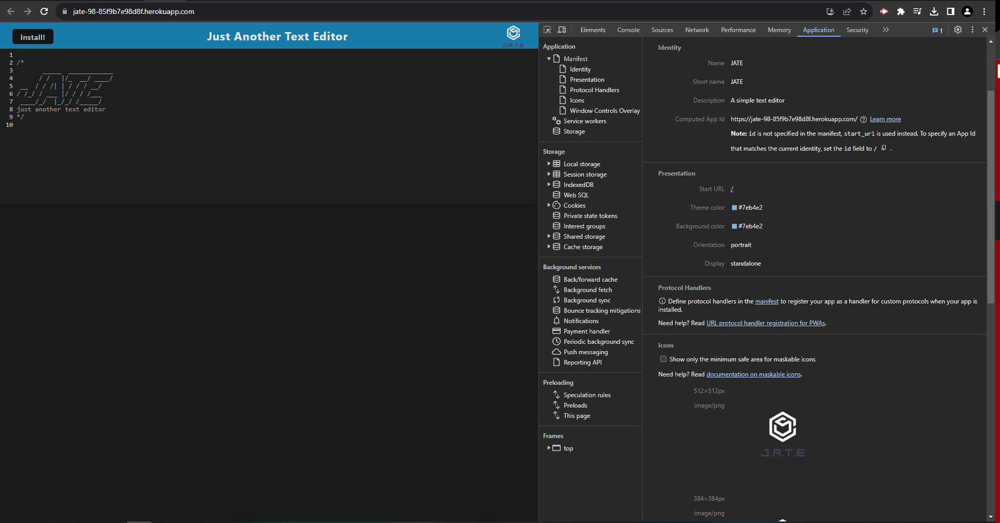

# Jate-text-editor

A text editor that can be used wether you are online or offline at the reach of your fingers

## Deployed

https://jate-98-85f9b7e98d8f.herokuapp.com/

## Screenshots
- The following image shows the application's manifest.json file:



- The following image shows the application's registered service worker:


- The following image shows the application's IndexedDB storage:


## Installation

Install with npm

```bash
  npm install 
```

## Authors

- [Diego Yavara](https://www.github.com/DNYC98)


## Acknowledgements

 - In class material 
 - TAs
 - Online research


## Badges

[](https://choosealicense.com/licenses/mit/)


## Installation

Install with npm

```bash
  npm install 
```
